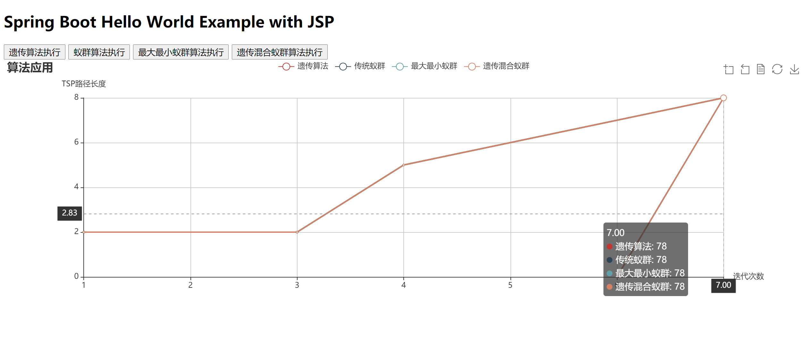

最近在研究蚁群及遗传算法，在一开始看资料文档的时候，虽然有很多博主有写文章，但是还是看的云里雾里的。后面知道看了最大最小蚁群系统的英文原文后，有了系统的了解。

---
- 启动后访问：http://localhost:9999/home

首先要区分一下几个概念的东西，一开始看蚁群算法的时候，下面几个算法在解释说明时，不注意看经常混淆这边贴出来，让大家了解一下。
- 蚁群优化算法 Ant Colony Optimization 简称ACO，正常指所有的蚁群算法。
- 蚂蚁系统 Ant System 简称 AS，正常指基本的蚁群算法。
- 蚁群系统 Ant Colony System 简称ACS，指的是基于基本的AS进行优化的一种算法。
- 最大最小蚁群系统 MAX–MIN Ant System 简称 MMAS，指的是基于基本AS进行优化的另一种算法。

### 1. 蚂蚁系统
基本的蚂蚁系统的解释很多，要注意信息素更新的策略，正常有以下三种：
- 蚁周模型（Ant-Cycle模型）
- 蚁量模型（Ant-Quantity模型）
- 蚁密模型（Ant-Density模型）
具体的介绍可以参考如下链接，博主讲的挺清楚的
- 蚁群算法介绍 https://blog.csdn.net/zuochao_2013/article/details/71872950

### 2. 蚁群系统
- 蚁群系统
https://baike.baidu.com/item/%E8%9A%81%E7%BE%A4%E7%B3%BB%E7%BB%9F/20868488?fr=aladdin#4_3

### 参考资料

- 蚁群算法介绍
https://blog.csdn.net/zuochao_2013/article/details/71872950
- 调参研究
https://blog.csdn.net/georgesale/article/details/80466909

https://www.ixueshu.com/document/c2ce2a60dbe1de5d542553fa5fbc246c318947a18e7f9386.html

https://www.ixueshu.com/document/214c9856c461100722e7ebd48d8a8032318947a18e7f9386.html

